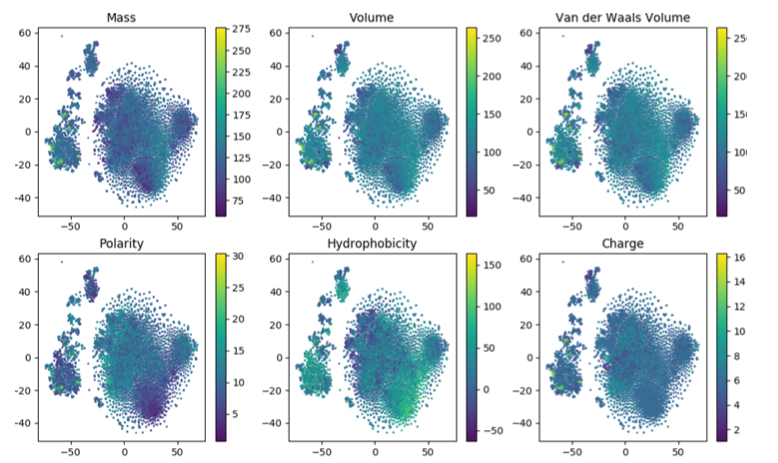
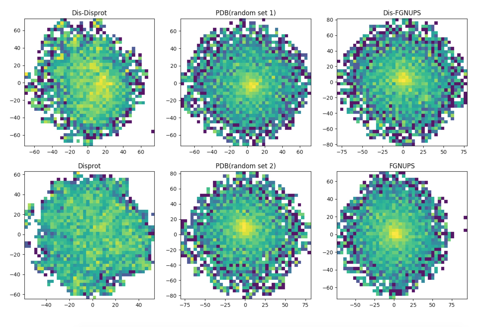

# 2017Bio2Vec
Protein classification over sum of protein ngrams vector representation

Ordinarily, biological information is represented by an array of characters, but it is suggested that by expressing it as a vector, information can be stored more easily for analysis. As a specific application range,

1. family classification
2. protein visualization
3. structure prediction
4. disordered protein identification
5. protein-protein interaction prediction.

Such Classification and prediction are easy to understand usage, but personally I felt that protein visualization would be most useful. Unless the sequence is short or the structure is already known, it seems that the current method of grasping the whole of protein is not popular in general, so I think that such expression method has certain usefulness. Although this idea seems strange at first glance, it is recognized to some extent in natural language.

See another implementation in https://github.com/kyu999/biovec, https://github.com/peter-volkov/biovec

Paper : http://journals.plos.org/plosone/article?id=10.1371/journal.pone.0141287

If you don't have Database, you can download from the below link.
=================================================================

Uniprot (Swiss-prot)
 - http://www.uniprot.org/downloads

Disprot
 - http://www.disprot.org/browse

If you don't working on mac OS try this
=================================================================
 - https://github.com/tensorflow/tensorflow/issues/5089


How to install and use
=================================================================
1. Install python packages.
  - pip install -r requirements.txt

  cf) If you use macos and get a problem about installation issue with matplotlib python, go to the next link.
     https://stackoverflow.com/questions/21784641/installation-issue-with-matplotlib-python

2. Download data file.
  - If you want to run original program, you have to download original database from below link.
	  https://drive.google.com/file/d/1qTbNRV2oDi4mBQ6RavuJXSSMtxr57ztT/view?usp=sharing
3. Move the downloaded file to our project directory.

4. And then, unzip downloaded file.
  1) If you download small DB
  - tar -xzvf small_DB.tar.gz

  2) If you download original DB
  - tar -xzvf original_DB.tar.gz

5. Run make_data_uniprot.py

6. Now you get ngram's corpus and ngram's vectors, protein's vectors, protein's families to uniprot_sprot.fasta

7. If you want to get how to we classify proteins into each family, please run bio_svm/train_svm_biovec.py
  - then you want to know how to we organize SVM using RBF kernels, try next commend.
   ```  
   tensorboard --logdir=./logs
   ```

description 
=================================================================
  - word2vec : Generating word2vec model from protein databases(gensim).

  - document : Protain databases(uniprot, Pfam, disprot, PDB...).

  - bio_tsne : TSNE(100D to 2D) 3gram vectors and protein vectors.

  - trained_models : Trained data made by make_data_uniprot.py

  - bio_svm : Classifying proteins (random PDB and FG-nups).

  - processd_data : Processing data( json file to fatsta , select data  , merge data)

  - biovisual : Visualization protein vectors

  - ngrams_properties : For the labeing 3gram aminoacid


How can see graph
=================================================================
1 3gram protein space 
=====================
1. Install python packages.
  - pip install -r requirements.txt

2. download document

2. run make_data_uniprot.py
  - python make_data_uniprot.py

3. run visualize.py
  - python visualize.py

4. choose PS(protein space)
  - just type PS

5. finally you can see 3gram protein space



2 binay svm with FG-nups and random PDBs
========================================
1. Install python packages.
  - pip install -r requirements.txt

2. download document
  - unzip document 
    dis-disprot.json , disprot.json ,dis-fg-nups.fasta , fg-nups.fasta , pdb_seqres.fasta , disordered-pdb.fasta
    move document to processed_data

3. run processed_sequence.py in processed_data
  - processed_seqence.py generate dir of binary_svm 

4. have to gzip dataset.fasta file and move binary_svm to document
  - dataset.fasta located 2017Bio2Vec/processed_data/binary_svm

5. run make_data_uniprot.py

6. run visualize.py

7. choos BSVM (binary svm) 

8. run binary_svm.py
    
9. finally you can see binary svm graph


3 density map
============
1. Install python packages.
  - pip install -r requirements.txt

2. download document
  - unzip document 
    dis-disprot.json , disprot.json ,dis-fg-nups.fasta , fg-nups.fasta , pdb_seqres.fasta , disordered-pdb.fasta
    move document to processed_data

3. run processed_sequence.py in processed_data
  - processed_seqence.py generate dir of binary_svm 

4. have to gzip all the data
  - the data  located 2017Bio2Vec/processed_data/binary_svm

5. run make_data_uniprot.py

6. run visualize.py

7. choos DM(density map)

8. finally you can see density map




